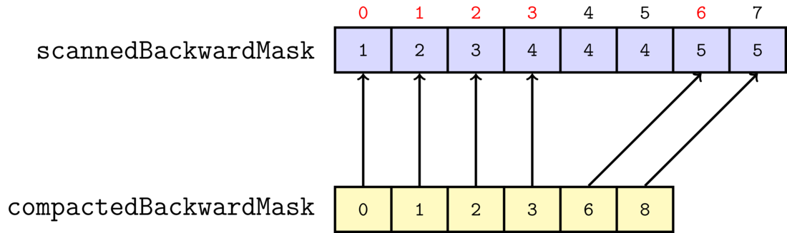
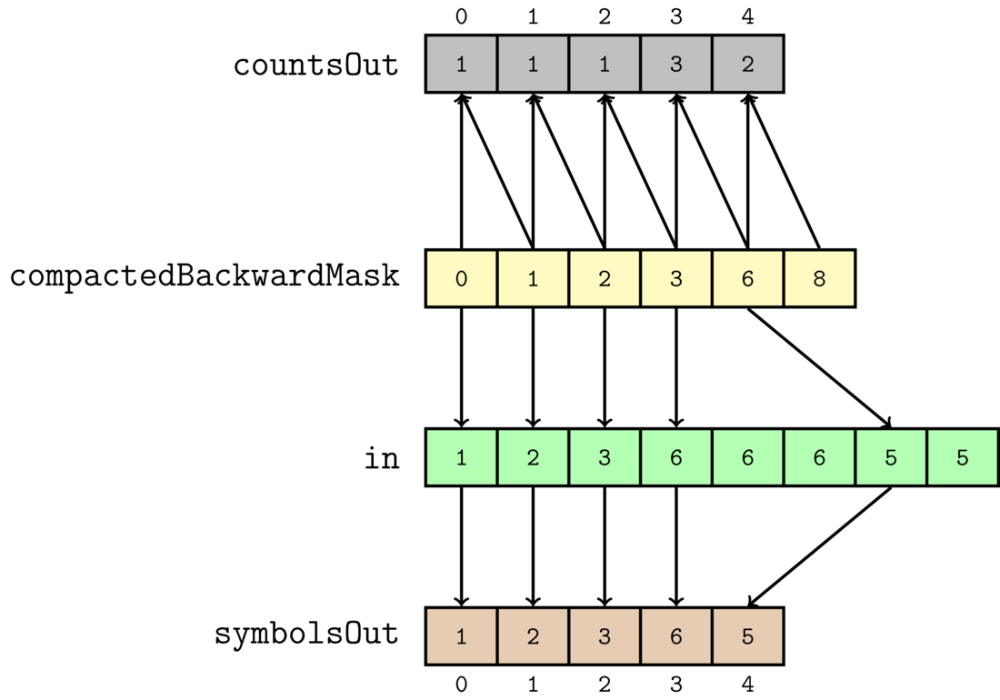

# Implementing Run-length encoding in CUDA

In order to fully understand this post, it is necessary that you understand
the following topics:

* Basic CUDA programming. So you should know how to write and launch a
  kernel.
* Prefix sum(also known as scan). You can study this topic [here](https://www.youtube.com/watch?v=We9j876CjtA&list=PLGvfHSgImk4aweyWlhBXNF6XISY3um82_&index=129)

So I will be making the assumption that the reader is knowledgeable in these topics.

## Introduction

In the paper [Fine-Grain Parallelization of Entropy Coding on
GPGPUs](http://tesla.rcub.bg.ac.rs/~taucet/docs/papers/HIPEAC-ShortPaper-AnaBalevic.pdf),
Ana Balevic describes how Run-length encoding(hereafter abbreviated
RLE) can be implemented on the GPU. Although the paper is very sparse
on details, I have been able to implement her approach in CUDA. For
the purpose of providing a supplementary document to her paper, I would now like
to go through how I implemented this technique in CUDA.

Before I begin, I want to mention that I have provided an
[implementation](https://github.com/Erkaman/parle-cuda) of the
technique on github.

## Introduction to Run-Length Encoding

RLE is a very simple compression algorithm. Let us say we have the
input data `[1,2,3,6,6,6,5,5]`. If we run RLE on this data, we obtain
the compressed data `[(1,1),(1,2),(1,3),(3,6),(2,5)]`. As can be seen,
by running RLE, we replace runs of repeated data by pairs on the form
`(x,y)`, where `y` is the symbol being repeated, and `x` is the number
of times the symbol is repeated. So the pair `(3,6)` represents the
data `[6,6,6]`.

In my CUDA implementation, I have chosen to split the output pairs
into two arrays. The first array contains the x:s, and the second
array contains the y:s. So running PARLE on the input data
`[1,2,3,6,6,6,5,5]` will yield the two output arrays `[1,1,1,3,2]` and
`[1,2,3,6,5]`.

Now, it should be obvious that the above compression scheme should be
extremely easy to implement on the CPU. A simple CPU implementation is
given below

```C++
int rleCpu(int *in, int n, int* symbolsOut, int* countsOut){

    if (n == 0)
        return 0; // nothing to compress!

    int outIndex = 0;
    int symbol = in[0];
    int count = 1;

    for (int i = 1; i < n; ++i) {
        if (in[i] != symbol) {
            // run is over.
            // So output run.
            symbolsOut[outIndex] = symbol;
            countsOut[outIndex] = count;
            outIndex++;

            // and start new run:
            symbol = in[i];
            count = 1;
        }
        else {
            ++count; // run is not over yet.
        }
    }

    // output last run.
    symbolsOut[outIndex] = symbol;
    countsOut[outIndex] = count;
    outIndex++;

    return outIndex;
}
```

Where `symbolsOut` contains the symbols that are being repeated, and
`countsOut` is the number of times said numbers are repeated. And the
return value is the number of repeated runs(i.e., the number of pairs)

But as can be seen the above algorithm is an extremely serial one, so
implementing it on the GPU can be a bit tricky. In fact, a large
majority of compression algorithms are all very serial
algorithms(examples of such algorithms are arithmetic coding, LZW, and
so on), and therefore hard to GPU accelerate. However, it would also
be very nice if we were able to implement them on the GPU. That would allow us
to, for instance, implement fast video codecs.

##  Parallel Run-Length Encoding

So, I shall now show how we can implement RLE on the GPU. Ana calls
this algorithm Parallel Run-Length Encoding, which we will from now on
abbreviate PARLE. Throughout my explanation, I shall through images
illustrate what happens to the input array `[1,2,3,6,6,6,5,5]`, as we
run it through the compression algorithm. Also, I shall henceforth
refer to this input array to as `in`

The first step of the algorithm is that we construct a mask from
`in`. We call this mask the `backwardMask`, and it is constructed as
follows: For every element `in[i]`, we assign a thread, and that
thread compares the current and the previous elements for equality. If
they are not equal, `backwardMask[i]` will be 1, and otherwise, it
is 0. However, the first element does not have a previous element, so,
for reasons that will soon become clear, we always set
`backwardMask[0]` to 1. The construction of the mask is also
illustrated through the below image.


The numbers over `in` are the ids of the threads assigned to every
element. To give an example, thread number 6 will do the following: It
will observe that `in[6] == 5`, and `in[5] == 6`, so it will set
`backwardMask[6] = 1`.

From the above illustration, we can draw a simple conclusion;
`backwardMask` encodes the beginning of all the runs. So if
`backwardMask[i]==1`, that means that at `i` a new repeated runs of
characters begin. Now it should be obvious why we said that
`backwardMask[0] == 1`.

From the above description, we can now easily implement a CUDA kernel:

```C++
__global__ void maskKernel(int *g_in, int* g_backwardMask, int n) {
    for (int i : hemi::grid_stride_range(0, n)) {
        if (i == 0)
            g_backwardMask[i] = 1;
        else {
            g_backwardMask[i] = (g_in[i] != g_in[i - 1]);
        }
    }
}
```

Where `i` becomes the thread id, and `n` is the length of the input array. And the above kernel is launched like

```C++
hemi::cudaLaunch(maskKernel, d_in, d_backwardMask, n);
```

And note that I am using [Hemi](https://github.com/harrism/hemi) to
launch the above Kernel. Launching CUDA kernels by using Hemi is nice,
because it will choose for you automatically a grid and thread block
size that, for your specific graphics card, gives you a nice amount of
occupancy. So it saves you from having to manually twiddle with thread block
and grid sizes.

Also, in order to assign a thread to every element, I am using yet
another nice utility function from Hemi:
`hemi::grid_stride_range`. This function implements a grid-stride loop
in your kernel, which is much more flexible than the traditional
approaches. You can read more about this
[here](https://devblogs.nvidia.com/parallelforall/cuda-pro-tip-write-flexible-kernels-grid-stride-loops/).

So that is how we construct `backwardMask`. In the next step, we run
an inclusive prefix sum(also called scan) on `backwardMask`, and we will call this
prefix sum `scannedBackwardMask`. The result of the scan is the below


There are many implementations of a prefix sum available, but in my
case, I chose to use the prefix sum provided by
[chag::pp](https://newq.net/archived/www.cse.chalmers.se/pub/pp/). According
to the authors, it is the fastest prefix sum available.

We can see that the prefix sum encodes a very important piece of
information. It encodes the output location of all the compressed
pairs!

For serial algorithms, such the RLE implemented on the CPU above,
knowing where to output the next element is often easy; you just
output to the next free spot in the array. However, doing the same
thing on the GPU is considerably more difficult, because we have lots of
threads working at the same time, and we have no idea in which order
they finish. As a result, finding the next free spot in the array is
often impossible. Instead what you often do, is that you basically twiddle with
prefix sums until you get what you want.

In our example, from the input data `[1,2,3,6,6,6,5,5]` we want the
output compressed arrays `[1,1,1,3,2]` and `[1,2,3,6,5]`(recall that
these are just the array of pairs split into two arrays). We can see
that the subarray of `6,6,6` has been represented as the pair `(3,6)`,
and it is output to the position `3`. However, now look at the
resulting prefix sum once more. Notice that the sequence `6,6,6` from `in`
is represented by a sequence of `4,4,4` in `scannedBackwardMask`:


This represents that the output location of the pair that represents
the sequence `6,6,6` will be `3 = 4-1`. So the above prefix
sum simply represents all the output locations plus one, for all the
outputted pairs. So by computing the above prefix sum, we have been
able to find the output positions of all the outputted pairs for our
GPU algorithm.

So that is why we are computing a prefix sum. In the next step, we will
have to create yet another auxiliary array. But fortunately, this will
be the last one. This last array is called `compactedBackwardMask`,
and it is slightly more tricky to understand than the other two.

At this point, we are very happy, because we know all the locations of the
output pairs(encoded through `scannedBackwardMask`), *and* we know which
symbols are being repeated(encoded through `backwardMask`. We
basically just have to output symbols from the positions where the
mask is 1). However,
we do not yet know how the long the runs are; `6,6,6` is compressed as
the pair `(3,6)`, and at this point we know `6`, and we know the
output position of the pair, but we have not yet
calculated `3`.

But, if we could now obtain an array that stores the indexes of the
beginnings of every run, we would be very happy again. Because we
could then calculate the run-lengths by subtracting the current
element and the previous element from each other in that array. And constructing
such an array is not very difficult. A kernel that implements this is
given below

```C++
__global__ void compactKernel(int* g_scannedBackwardMask,
                              int* g_compactedBackwardMask,
                              int* g_totalRuns,
                              int n) {
    for (int i : hemi::grid_stride_range(0, n)) {

        if (i == (n - 1)) {
            g_compactedBackwardMask[g_scannedBackwardMask[i]] = i + 1;
            *g_totalRuns = g_scannedBackwardMask[i];
        }

        if (i == 0) {
            g_compactedBackwardMask[0] = 0;
        }
        else if (g_scannedBackwardMask[i] != g_scannedBackwardMask[i - 1]) {
            g_compactedBackwardMask[g_scannedBackwardMask[i] - 1] = i;
        }
    }
}
```

Basically, what we do is that we run a thread for every element in
`scannedBackwardMask`. If the current and the previous elements are not
equal, that means that a new run starts at that index. So we would now
like to output that index, and that index is just the thread id
`i`. And we output at `scannedBackwardMask[i] - 1`, because as
already stated, `scannedBackwardMask` encodes the output positions of
all the pairs plus one.

We also have two special cases:

* The first element has no previous element, so we just output 0. But this makes sense, since a run will always start at the first element
* For the very last element, in addition to checking the previous element, we do two additional things. **(1)** at the end of the output array, we output the total size of `in`(which is `n`). It will soon make sense why we do this. **(2)** we also output the total number of runs/pairs in `totalRuns`. And this number is certainly the last element of `scannedBackwardMask`, because `scannedBackwardMask` is the inclusive prefix sum of `backwardMask`.

Also, I call the output array `compactedBackwardMask` , because it
will often end up much smaller than the input `in`.

The below image also illustrates the algorithm



To give an example, we output 6 to the index 4, because
`scannedBackwardMask[6] != scannedBackwardMask[5]`. And the output
index is calculated as `scannedBackwardMask[6]-1 = 5 - 1 = 4`. Also,
notice that thread 7, the last thread, outputs the length of `in` to
the last element of `compactedBackwardMask`

Now that we have obtained the auxiliary array `compactedBackwardMask`,
we can finally finish the compression. We finish the compression in
our final kernel `scatter`, and it is actually rather simple:

```C++
__global__ void scatterKernel(
              int* g_compactedBackwardMask,
	      int* g_totalRuns,
	      int* g_in,
	      int* g_symbolsOut,
	      int* g_countsOut) {
    int n = *g_totalRuns;

    for (int i : hemi::grid_stride_range(0, n)) {
        int a = g_compactedBackwardMask[i];
        int b = g_compactedBackwardMask[i + 1];

        g_symbolsOut[i] = g_in[a];
        g_countsOut[i] = b - a;
    }
}
```

We illustrate the kernel by the following image



We assign a thread to every element in `compactedBackwardMask`. And we
are using `totalRuns` to determine which threads needs to work, and
which threads should do nothing. Every
thread looks at the current element, and the next one. Since
`compactedBackwardMask` simply encodes the beginnings of every run of
repeated characters, we can just compute the difference between the
next element and the current element in `compactedBackwardMask`, to
compute the length of a single run. That is how we compute the output
array `countsOut`. So, for instance, we have that `countsOut[3]==3`, because
`compactedBackwardMask[4] - compactedBackwardMask[3] = 6 - 3 = 3`. Now
it should be clear why the last element of `compactedBackwardMask` was
set to `n` by `compactKernel`.

It is also easy to compute `symbolsOut`. Because, again,
`compactedBackwardMask` encodes the indices of the beginnings of the repeated runs in the
original data. So we can just use that index to take the first element
of that run from `in`, and store it in `symbolsOut`. So
`symbolsOut[4]==5`, because `in[compactedBackwardMask[4]] = in[6] =
5`.

And that was the entire algorithm! As can be seen, it is much more
complex than the CPU implementation. But when we benchmark PARLE, we
will realize that all that extra complexity is well worth it

## Benchmarks

Now, how well does PARLE stack up against the CPU? Pretty well, it
turns out.

I benchmarked PARLE for two kinds of input data. **(1)** Entirely random data on the
form `[1,3,5,2,...]`, and **(2)** very compressible data with lots of repeated
symbols on the form `[1,1,1,1,6,6,6,7,7,7,7,7,7,...]`. The thing is
that if the data is very compressible, then `compactedBackwardMask`
will be much smaller than `in`, which means that the final
`scatterKernel` has to do much less work. For that reason,
compressible data should compress much faster than random data.

When benchmarking PARLE, I made sure that I uploaded all the input data
to the device, and made sure to allocate all memory on the device
before doing the benchmarking. This ensures that I will only be testing the actual
performance of the algorithm on the GPU, and not the transfer
performance from the CPU to the GPU, which is uninteresting for us.

I benchmarked PARLE on my GTX960, and obtained the following results:


Note that I tested the CPU implementation of RLE on both compressible
data and random data, but the results were so similar that I decided on
just showing one of them for the CPU.

As can be seen from the above graph, PARLE greatly outperforms the CPU
version for large data sets. PARLE is up to 5 times faster than the
CPU. Ana claims that by using shared memory atomics, she is able to
make it up to 35 times faster. But I have refrained from doing such heavy
optimization in my implementation, in order to keep the code neat and
readable.

For those interested, the raw benchmarking data that was used to produce the above
graph can be found
[here](https://github.com/Erkaman/erkaman.github.io/blob/master/src/cuda_rle_gnuplot/data.dat)

## Possible Further Optimization

As stated above, Ana's implementation is up to 35 times faster than
the CPU. This is because her optimized implementation uses shared
memory atomics. When I profiled PARLE in Nvidia Visual Profiler, I
found that the algorithm is heavily bottlenecked by memory; the
arithmetic intensity is very low, so the execution time dominated by
the time it takes to read from the global memory. So if you want to
implement a faster version of PARLE, you will need to minimize your
reads and writes to the global memory. And one way of doing this is, like
Ana did, to use shared memory.
