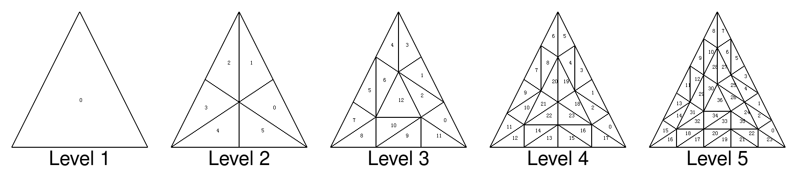
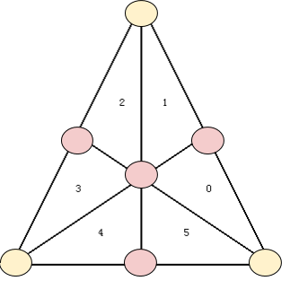
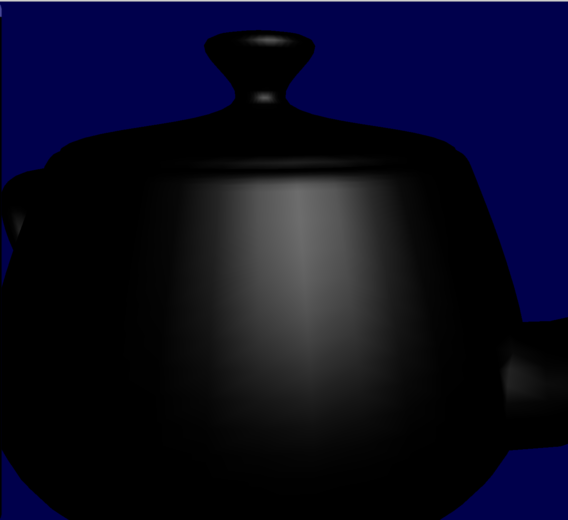
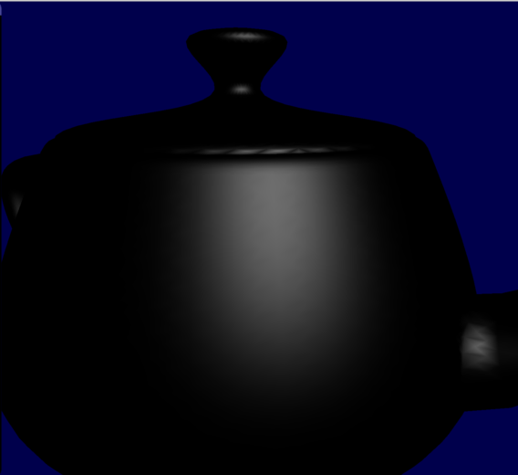
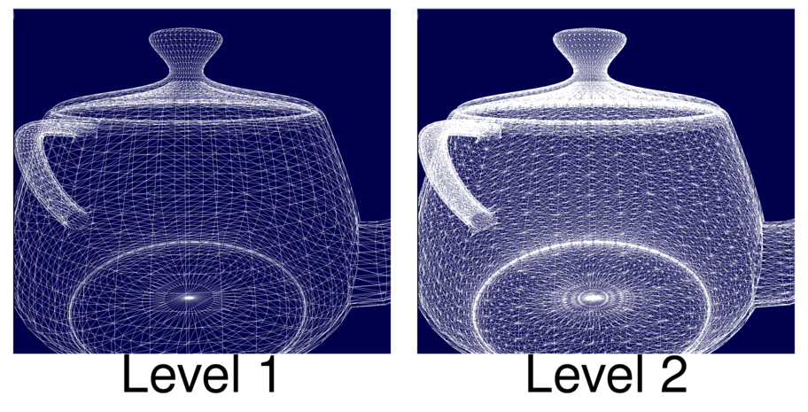
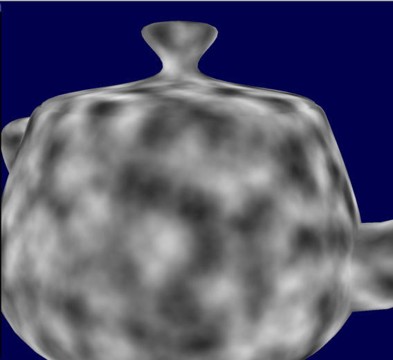
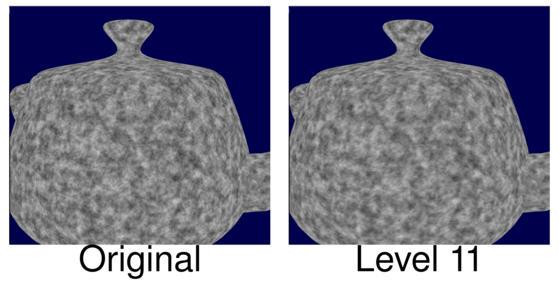

# Making Faster Fragment Shaders by Using Tessellation Shaders

In order to fully understand this post, it is necessary that you understand
the following topics:

* Basic usage of Tessellation Shaders. You can study this topic [here](http://ogldev.atspace.co.uk/www/tutorial30/tutorial30.html) and [here](http://ogldev.atspace.co.uk/www/tutorial31/tutorial31.html)
* Barycentric Coordinates. You can study this topic [here](http://www.scratchapixel.com/lessons/3d-basic-rendering/ray-tracing-rendering-a-triangle/barycentric-coordinates)
* Perlin Noise and Simplex Noise. You can study this topic [here.](http://webstaff.itn.liu.se/~stegu/simplexnoise/simplexnoise.pdf)

So I will be making the assumption that the reader is knowledgeable in these topics.

## Introduction

In the paper [Automatic Shader Simplification using Surface Signal
Approximation](http://www.cad.zju.edu.cn/home/bao/pub/36.pdf), Wang et
al. describes an algorithm that does automatic shader
simplification. Put briefly, the algorithm automatically rewrites
shaders so that they become much, much faster. They are using several
techniques to achieve this, and one of those techniques I'd like to
describe in this post. The technique is that they are moving
expensive operations from the fragment shader into some earlier shader
stage, and by doing so they greatly reduce the number of times said
operation has to be evaluated. In this article, I shall in much detail
describe this technique.

## Explaining the Main Idea

So, let us say that we have a shader with a fragment shader that is very
expensive(we are focusing our efforts on simplifying the fragment
shader, because it is the shader stage that tends to be the most
expensive nowadays).  Now, how could we make this shader less
expensive? One way of achieveing a speedup, is that we simply try to
run the fragment shader less. The main reason that a fragment shader
is expensive, is because it has to be evaluated for every single
fragment that the geometry covers.

But is it really necessary to evaluate it for every single fragment? Maybe it
could be enough to evaluate it for the vertices of the geometry, and
then in the fragment shader we interpolate between the values computed at
the vertices? Let us try that idea out! So, let us try optimizing the
following shader:

```glsl
//
// Vertex Shader
//
layout(location = 0) in vec3 vsPos;
layout(location = 1) in vec3 vsNormal;

out vec3 fsPos;
out vec3 fsNormal;

uniform mat4 uMvp;

void main()
{
    fsPos = vsPos;
    fsNormal = vsNormal;

    gl_Position = uMvp * vec4(vsPos, 1.0);
}

//
// Fragment Shader
//
in vec3 fsPos;
in vec3 fsNormal;

out vec3 color;

uniform mat4 uView;

void main()
{
    color = doSpecularLight(fsNormal, fsPos, uView);
}

```

where the function `doSpecularLight` simply does a standard specular
light calculation. And since we are calling this function in the
fragment shader, that means that the function will be evaluated for
every single fragment that the geometry covers. If `doSpecularLight`
were expensive to evaluate, it would certainly be very expensive to
evaluate it for every single fragment.

If we apply the above shader on a teapot, the result is the following:


Let us now try the idea that I mentioned above; let us move that
specular calculation from the fragment shader to the vertex shader. So
we essentially move code from the fragment shader to the vertex
shader:


So let us do that to the shader:

```glsl
//
// Vertex Shader
//
layout(location = 0) in vec3 vsPos;
layout(location = 1) in vec3 vsNormal;

out vec3 fsResult;

uniform mat4 uView;
uniform mat4 uMvp;

void main()
{
    fsResult = doSpecularLight(vsNormal, vsPos, uView);

    gl_Position = uMvp * vec4(vsPos, 1.0);
}


//
// Fragment Shader
//
in vec3 fsResult;

out vec3 color;

void main()
{
    color = fsResult;
}

```

So now we are calling `doSpecularLight` in the vertex shader, and then
sending the result to the fragment shader. The value that is received
by the fragment shader, is calculated by the hardware by interpolating
between the values at the three vertices of the triangle that contains
the fragment(this
interpolation is based on barycentric coordinates, and you can read more
about this
[here](http://www.scratchapixel.com/lessons/3d-basic-rendering/ray-tracing-rendering-a-triangle/barycentric-coordinates)
).

So the resulting specular lighting is not true fragment shader
specular lighting. Rather, we are trying to approximate the fragment
shader specular lighting by interpolating between the values at the
vertices. However, since we are not computing the specular lighting
for every single fragment, but only for the vertices, the resulting
shader should be much cheaper.


How does this new shader look? Like this:


As can be observed, doing the calculation in the vertex shader results
in a noticeable drop in quality; the specular highlight is longer
round, but a has a slightly blocky appearance at the borders. And we
can see some obvious banding artifacts.

Why do we obtain such a horrendous result? The main problem is that
the specular lighting generates a relatively high frequency signal,
and if we compute
too few samlpes, we will not be able to approximate this signal by
just using barycentric interpolation. In our case, the samples are
taken at every vertex. And how many vertices does our teapot model have?
Let us render it as wireframe:


Now, look at the vertex density in the region where the big
highlight was rendered. As can be observed, the vertex density is not very high, and thus the
number of samples will be too low to approximate the original signal.

So if we want a better result, we need to take more samples. Wang et
al. came up with an elegant and ingenious solution to this problem: we
simply use a tessellation shader to subdivide the triangles of the
mesh into subtriangles! By doing so, the vertex density of the model
will be increased, and so, we can compute even more samples at the
vertices and calculate a better approximation!

## Tessellation Shaders

I will now explain how the idea of Wang et al. can be implemented in
OpenGL, by using tessellation shaders.

As has already been stated, we will divide all triangles of the
original mesh into subtriangles, and by doing so increase the vertex
density. Wang et al. define the following tessellation levels in the
[supplementary document](http://www.cad.zju.edu.cn/home/rwang/projects/shader-optimization/14shaderopt_supp.pdf) they provided:




So basically, for tessellation level one, we do not subdivide the
triangles at all, but let them be. But for level 2, we add four extra
vertices and subdivide the triangle into six triangles, and so on.

It turns out that this kind of subdivision is surprisingly easy to
implement using tessellation shaders. To do this in OpenGL, first we
need to add two new shader stages: the Tessellation Control Shader,
and the Tessellation Evaluation Shader(hereafter abbreviated TCS and
TES). If we add these two stages, our shader pipeline will look like this:


So, we add the two new shader stages between the vertex and fragment
shaders. Furthermore, the specular calculation is no longer moved from
the fragment shader to the vertex shader, but from the fragment shader to
TES. This is because we do not have access to all vertices in the
vertex shader. In particular, we only have access to the vertices
created through tessellation in TES, and so we must move the specular
calculation to TES, and not the vertex shader!

Now, I shall go through what our new shader looks like. First the
vertex shader:

```glsl
layout(location = 0) in vec3 vsPos;
layout(location = 1) in vec3 vsNormal;

out vec3 tcsPos;
out vec3 tcsNormal;

void main(){
	tcsPos = vsPos;
	tcsNormal = vsNormal;
}
```

We will not be doing the specular calculation in the vertex shader
anymore, so it is simply a pass-though shader now. Next, let us look
at TCS:

```glsl
in vec3 tcsPos[];
in vec3 tcsNormal[];

layout(vertices=3) out; // (1)
out vec3 tesPos[];
out vec3 tesNormal[];

uniform float uTessLevel;

void main(){

    // (2)
    tesNormal[gl_InvocationID] = tcsNormal[gl_InvocationID];
    tesPos[gl_InvocationID] = tcsPos[gl_InvocationID];

    // (3)
    gl_TessLevelOuter[0] = uTessLevel;
    gl_TessLevelOuter[1] = uTessLevel;
    gl_TessLevelOuter[2] = uTessLevel;

    // (4)
    gl_TessLevelInner[0] = uTessLevel;
}
```

I will explain the marked sections of the code. In `(1)` we specify the patch size. The TCS takes
a list of patches, and does subdivision on them. Since in our case
`vertices=3`, we have that the patches are simply the triangles of the
original mesh.

To every vertex of the patch(all three of them), we associate a normal
and a position(in our case, simply the positions and normals from the original mesh), which is what we are doing in `(2)`. We output these
because we will be needing them in the TES later.

Next, we need to specify the tessellation pattern for the
patch. `gl_TessLevelOuter[i]` specifies how many subedges we should
divide the i:th edge into. So in `(3)` we are specifying that every
single edge of every single triangle should be subdivided into
`uTessLevel` subedges. Also, note that if `uTessLevel=1`, then no
subdivision will be done at all.

Finally, in `(4)`, we are specifying how many times we should
subdivide the inner part of the triangle.

It should now be clear that if `uTessLEvel=2`, then every triangle
will be subdivided according to the tessellation level 2 I showed in the
image above.

That was the TCS. Next comes the TES

```glsl
layout(triangles,equal_spacing) in;
in vec3 tesPos[];
in vec3 tesNormal[];

out vec3 fsColor;

uniform mat4 uMvp;
uniform mat4 uView;

vec3 lerp3D(vec3 v0, vec3 v1, vec3 v2)
{
    return vec3(gl_TessCoord.x) * v0 + vec3(gl_TessCoord.y) * v1 + vec3(gl_TessCoord.z) * v2;
}

void main(){
    vec3 pos = lerp3D(tesPos[0],tesPos[1],tesPos[2]);
    vec3 normal = lerp3D(tesNormal[0], tesNormal[1], tesNormal[2]);

    gl_Position = uMvp* vec4(pos, 1.0 );

    fsColor = doSpecularLight(normal, pos, uView);
}

```

This one is a bit more difficult to understand. First, look at this image:




This is a triangle that has been tessellated to level 2. Note that now
that the TCS has been executed, the tessellation has been
performed. The yellow circles are the 3 vertices of the original
patch(in our case, a triangle), and the positions of these vertices
are contained in the input array `tesPos`, and their normals are in
`tesNormal`(remember that these were output from TCS!).

The positions and normals of the yellow vertices we already
know. However, by the TCS 4 new vertices were created(they are the pink
circles in the image), and we do not yet know their positions nor
their normals. Kindly enough, however, the barycentric coordinates of
the vertices created through tessellation are sent to the TES. They are
`(gl_TessCoord.x, gl_TessCoord.y, gl_TessCoord.z)`. For instance, the
barycentric coordinates of the center vertex in the above image will
be `(1/3,1/3,1/3)`.

But we can just use these barycentric coordinates to compute the
positions and normals from `tesPos` and `tesNormal`(this makes sense,
because recall that barycentric coordinates allow us to perform
interpolation on a triangle.).

To summarize, all that the line  `vec3 pos =
lerp3D(tesPos[0],tesPos[1],tesPos[2]);` does is that it performs
barycentric interpolation to obtain the positions of all the vertices
on the tessellated triangle.

Now, note that all the vertices, including the ones created through
tessellation, will pass through TES. Thus, it is in this shader stage, and
not the vertex shader stage, that we will compute the specular
lighting.

Now all that remains is the fragment shader:

```glsl
in vec3 fsColor;

out vec3 color;

void main(){
    color = fsColor;
}
```

After running TCS and TES, the mesh will now consist of many triangles
created through tessellation. And every vertex will have a specular
value associated with it(this was calculated in the end of TES). Now,
the fragment will be contained in exactly one such triangle, and the
specular value inputted to the fragment shader will be computed by
interpolating between the specular values at the vertices of said
triangle(this is all done by the hardware for us!). Since the tessellation has increased the vertex density,
this should result in a much better approximation of the original
fragment shader specular lighting.

How much better does this look? Here is the result for tessellation
level 1:




But for tessellation level 1 we are not doing any tessellation at all,
so we get the same results as we did when we were doing the
calculation for every vertex. So let us try level 2




This already looks much better! And note that level 2 has 6 times as
many triangles as level 1. Below we can see the difference in vertex density.



But tessellation level 2 still have some very slight banding
artifacts. But by increasing the level to 3, that problem pretty much
goes away:


Let us now compare level 3 with the original fragment shader specular:


As can be observed, the approximation is now almost perfect! But the
tessellated version should be much faster, since it does not compute
the specular lighting for every single fragment!

## Speeding up Procedural Textures

So by doing what we described above, we are able to speedup a specular lighting
calculation. However, that is a very silly example, because specular lighting
is not at all expensive to compute, even if we are doing it for every
single fragment. So let us instead speedup a more expensive type of
shader: A Procedural Texture Shader. A procedural texture shader uses
a Simplex/Perlin noise to compute a texture in real-time, in the
fragment shader. One advantage of such a texture is that it is very
easy to make such a texture tile. But one disadvantage is that it is
quite expensive to calculate a texture in real-time. But by using the
technique described by Wang et al., we may be able to alleviate that
issue.

We will create a procedural texture by adding 4 octaves of
Simplex noise. When applied to the teapot, the texture looks like this:




In the above image, the texture is being computed for every single
fragment, using the fragment position as input to the noise
function. But this is quite expensive, so let us test whether we can
approximate the texture by moving that texture calculation from the
fragment shader to the TES(and we will be using the tessellated vertex
position as input to the noise function). In the below montage, we can see the
resulting textures for different tessellation levels:


As can be observed, already in level 3 we are getting quite acceptable
results. But how fast is this? I tested it on two devices: my Macbook
running Intel Iris 5100(an integrated graphics card), and my
stationary desktop running GeForce GTX 960. In
the profiling test, I position the camera such that the teapot covers
the entire screen. This means that the fragment will have to be
evaluated for every single pixel, and so it is maximally expensive. By
using Query Objects I then measure the average time taken to render
the teapot. We can see the results in the table below


|            | Intel Iris     | GTX 960       |
-------------| -------------  | ------------- |
**Original** | 12.1ms         | 4.63ms       |
**Level 1**  | 2.67ms         | 0.78ms       |
**Level 2**  | 4.27ms         | 1.83ms       |
**Level 3**  | 6.21ms         | 2.63ms       |
**Level 4**  | 7.65ms         | 4.75ms       |
**Level 5**  | 7.88ms         | 4.88ms       |

As can be seen, the winnings are huge for the integrated graphics
card; doing the calculation in TES is always faster! The integrated
graphics card has very few shader cores compared to a real graphics card,
and so it struggles a lot with computing the procedural texture in
real time. But by doing the computation in TES, the graphics card does
not have to do as much work anymore, and it becomes much faster.

But we can also see that the GTX 960 is a lot faster. This makes sense, as it has a lot more
shader cores at its disposal. Even so, up to tessellation level 3 we are
obtaining a speedup from using the tessellation technique. But beyond
that level, it seems that the overhead from doing all the tessellation
becomes too much, and it becomes slower. But we can see that it is
certainly possible to use the technique in order to make faster
procedural textures

## Drawbacks

But like all techniques, this technique is not without its
drawbacks. A first drawback is that, since the technique uses
tessellation shaders, you will need a relatively up-to-date graphics
card. In particular, it [must support at least OpenGL 4.0](https://www.opengl.org/wiki/Tessellation)

Another drawback of the technique is that sometimes you will need a
ridiculously high tessellation level to provide a decent
approximation. The previous procedural texture we could approximate with relatively low
levels of tessellation. But that was only because the texture was a
rather low-frequency texture(it was rather blurry and did not have
much detail). If we try the same thing on a more
high-frequency texture, that is, a texture with more detail, things
will not go very well. If I tested the technique on a detailed
procedural texture, I needed at least a tessellation level of 11 to
provide a decent approximation:



But if I tested the performance on my Intel Iris 5100, the original
one had a render time of 27ms, but the tessellated one had a render
time of 65ms! I suppose it is much slower because doing all that
tessellation creates a large amount of overhead.

So it is not a good idea to apply this technique on high frequency
signals. That is, if some calculation in the fragment shader
generates a high frequency signal, it would be a very bad idea to move
that calculation to TES, because we would need an absurdly high
tessellation level. But as long as the signal is not too high
frequency, we should pretty much be safe, I suppose.

Wang et al. are using evolutionary programming to determine which
computations are low frequency to the degree that they can be moved
from the fragment shader to TES. But it is certainly also possible to
determine this manually, by moving out different calculations to TES
and then profiling.

## Conclusion

Even with all of its drawbacks, I still think that this technique
presented by Wang et al. is a very nice technique, and as I have
shown, it may lead to significant speedups if used properly. If you
ever are struggling with squeezing out the last bits of performance
out of an expensive fragment shader, this technique is definitely
something you shoulder consider using.

Also, I have provided a [demo
application](https://github.com/Erkaman/tess-opt) of the technique on
github. This application was used to produce all the teapot images
seen in this article. Below is an image of the application


Finally, do note that the technique I presented here is just one of
the shader simplification techniques discovered by Wang et
al. Another brilliant technique that they discovered, is that you can use
Bezier triangles to approximate shaders, and by doing so achieve
significant speedups Once I have time, I am planning on making a
write-up about this second technique a well, so, please, look forward that!
