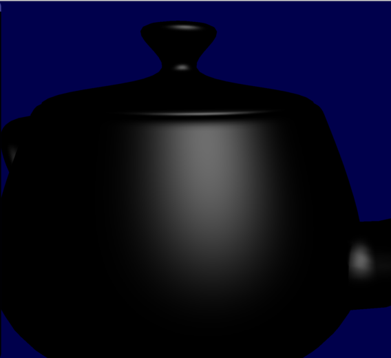
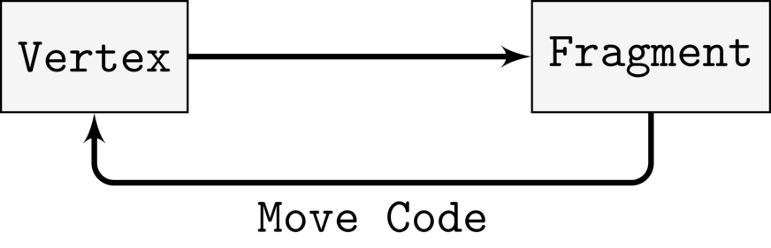

# Making Faster Fragment Shaders by Using Tessellation Shaders

## Introduction

In the paper [Automatic Shader Simplification using Surface Signal
Approximation](http://www.cad.zju.edu.cn/home/bao/pub/36.pdf), Wang et
al described an algorithm that does automatic shader
simplification. Put briefly, the algorithm automatically rewrites
shaders so that they become much, much faster. They are using several
techniques to achieve this, and one of those techniques I'd like to
described in this post. The technique is that they are moving
expensive operations from a fragment shader into some earlier shader
stage, and by doing so they greatly reduce the number of times said
operation has to be evaluated. In this article, I shall in much detail
describe this technique.

## Explaining the Main Idea


So, let us say that we have a shader with fragment shader that is very
expensive(we are focusing our efforts in simplifying the fragment
shader, because it is the shader stage that tends to be the most
expensive nowadays).  Now, how could we make this shader less
expensive? One way of achieveing a speedup, is that we simplify try to
run the fragment shader less. The main reason that a fragment shader
is expensive, is because it has to be evaluated for every single
fragment that the geometry covers.

But is it really to evaluate it for every single fragment? Maybe it
could be enough to evaluate it for the vertices of the geometry, and
then in the fragment shader we interpolate between the values computed at
the vertices? Let us try that idea out! So, let us try optimizing the
following shader:

```glsl
//
// Vertex Shader
//
layout(location = 0) in vec3 vsPos;
layout(location = 1) in vec3 vsNormal;

out vec3 fsPos;
out vec3 fsNormal;

uniform mat4 uMvp;

void main()
{
    fsPos = vsPos;
    fsNormal = vsNormal;

    gl_Position = uMvp * vec4(vsPos, 1.0);
}

//
// Fragment Shader
//
in vec3 fsPos;
in vec3 fsNormal;

out vec3 color;

uniform mat4 uView;

void main()
{
    color = doSpecularLight(fsNormal, fsPos, uView);
}

```

where the function `doSpecularLight` simply does a standard specular
light calculation. And since we are calling this function in the
fragment shader, that means that the function will be evaluated for
every single fragment that the geometry covers. If `doSpecularLight`
were expensive to evaluate, it would certainly be very expensive to
evaluate it for every single fragment.

If we apply the above shader on a teapot, the result is the following:



Let us now try the idea that I mentioned above; let us move that
specular calculation from the fragment shader to the vertex shader:


```glsl
//
// Vertex Shader
//
layout(location = 0) in vec3 vsPos;
layout(location = 1) in vec3 vsNormal;

out vec3 fsResult;

uniform mat4 uMvp;

void main()
{
    fsResult = doSpecularLight(vsNormal, vsPos, uView);

    gl_Position = uMvp * vec4(vsPos, 1.0);
}


//
// Fragment Shader
//
in vec3 fsResult;

out vec3 color;

void main()
{
    color = fsResult;
}

```

So now we are calling `doSpecularLight` in the vertex shader, and then
sending the result to the fragment shader. The value that is received
by the fragment shader, is calculated by hardware by interpolating
between the three vertices that are closest to the fragment(this
interpolation is based on barycentric coordinates, and you can more
about this
[here](http://www.scratchapixel.com/lessons/3d-basic-rendering/ray-tracing-rendering-a-triangle/barycentric-coordinates)
).

So the resulting specular lighting is not true fragment shader
specular lighting. Rather, we are trying to approximate the fragment
shader specular lighting by interpolating between the values at the
vertices. However, since we are not computing the specular lighting
for every single fragment, but for only the vertices, the resulting
shader should be much cheapter


How does this new shader look? Like this:


As can be observed, doing the calculation in the vertex shader results
in a noticeable drop in quality; the specular highlight is longer
round, but a has a slightly blocky appearance at the borders. And we
can see some obvious banding artifacts.

Why do we obtain such an horrendous result? The main problem is that
the specular lighting generates a relatively high frequency signal, and if take
too few samlpes, we will not be able to approximate this signal by
just using barycentric interpolation. In our case, the samples are
taken at every vertex. And how many vertices does our teapot model have?
Let us render it as wireframe:


Now, look at the vertex density at the location where the big
highlight was rendered. As can be observed, the vertex is not very high, and thus the
number of samples will be to low to approximate the original signal.

So if want a better result, we need to take more samples. Wang et
al. came up with a elegant and ingenious solution to this problem: we
simply use a tessellation shader to subdivide the triangles of the
mesh into subtriangles! By doing so, the vertex density of the model
will be increased, and so, we can compute even more samples at the
vertices and calculate a better approximation!

## Tessellation Shaders

I will now explain how the idea of Wang et al. can be implemented in
OpenGL using tessellation shaders.


