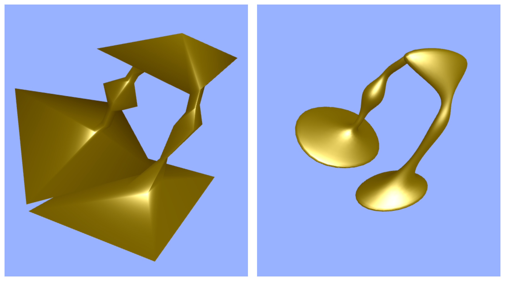

# The Second Article

pnp-gui(plug n' play GUI) is a WebGL gui toolkit whose main goal is to be easy to use, bloat-free, and be easy to
integrate into any project. Impatient people probably want a demo right away,
and [here](https://github.com/Erkaman/pnp-gui#demo) it is.

This is `code` and this is *lol*

## Subheading

Here is a nice image:



* One guy
* Another guy
* A third guy.

## Another subheading

In this section, we give a tutorial that demonstrates how easy it is to use
the toolkit. First we give the source code of another simple demo:

```C++
__global__ void maskKernel(int *g_in, int* g_backwardMask, int* g_forwardMask, int n) {

    //__shared__ int

    for (int i : hemi::grid_stride_range(0, n)) {
        if (i == 0)
            g_backwardMask[i] = 1;
        else {
            g_backwardMask[i] = (g_in[i] != g_in[i - 1]);
        }

        if (i == (n - 1))
            g_forwardMask[i] = 1;
        else {
            g_forwardMask[i] = (g_in[i] != g_in[i + 1]);
        }
    }
}
```
